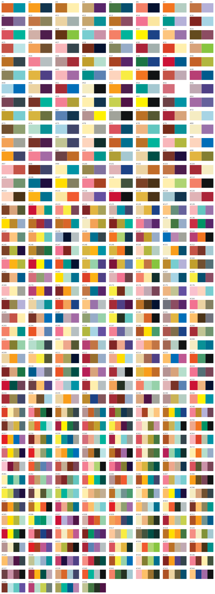

# color-combinations-css

The **348 color combinations** from Sanzo Wada's *A Dictionary of Color Combinations*, packaged as overridable CSS custom properties — grouped by theme, ready to serve from a CDN.

No JavaScript, no build step. Just a single CSS file.

## The combinations

Every combination, numbered `#1`–`#348`. Find one you like and use its number.



## Install

```bash
npm install color-combinations-css
```

Or use it straight from a CDN — no install:

```html
<link
  rel="stylesheet"
  href="https://cdn.jsdelivr.net/npm/color-combinations-css@2.0.0/color-combinations.css"
>
```

(unpkg works too: `https://unpkg.com/color-combinations-css@2.0.0/color-combinations.css`)

## Usage

Set `data-color-combination="N"` (N = 1–348) on any element. Everything inside it inherits
that combination's colors through CSS variables:

```html
<section data-color-combination="176">
  <h1 style="color: var(--cc-1); background: var(--cc-2)">Hello</h1>
  <p style="color: var(--cc-3)">…</p>
</section>
```

Each combination defines `--cc-1` … `--cc-N`, where N is 2, 3, or 4 depending on the
combination (120 are 2-color, 120 are 3-color, 108 are 4-color). Colors are ordered by
their position on the original plate.

Put `data-color-combination` on `<html>` to theme the whole page:

```html
<html data-color-combination="42"> … </html>
```

### Load just one combination

If you only want a single palette and don't need all 348, load that combination's
file instead — it sets `--cc-1 … --cc-N` directly on `:root`, so it themes the whole
page with ~200 bytes:

```html
<link
  rel="stylesheet"
  href="https://cdn.jsdelivr.net/npm/color-combinations-css@2.0.0/combos/176.css"
>
```

```css
/* or in a bundler */
@import "color-combinations-css/combos/176.css";
```

No `data-color-combination` attribute needed in this mode — the variables are global.

### Aliasing to your own names

The `--cc-` prefix is intentionally neutral so it never collides with framework tokens
like `--primary`. Map them to friendlier names in your own stylesheet:

```css
:root {
  --bg: var(--cc-1);
  --fg: var(--cc-2);
  --accent: var(--cc-3);
}
```

## Why `--cc-N` and not `--primary`?

`--primary` / `--secondary` carry semantic meaning in front-end frameworks (Bootstrap,
Material, Tailwind, shadcn) — "the brand color," "the action color." These combinations
are just ordered, harmonious sets with no inherent roles, and a neutral prefix avoids
clobbering existing design tokens.

## Data & license

Color data is from [`dictionary-of-colour-combinations`](https://github.com/mattdesl/dictionary-of-colour-combinations)
(digitized from Sanzo Wada's book, public domain). This packaging is released under the
[MIT License](./LICENSE).
